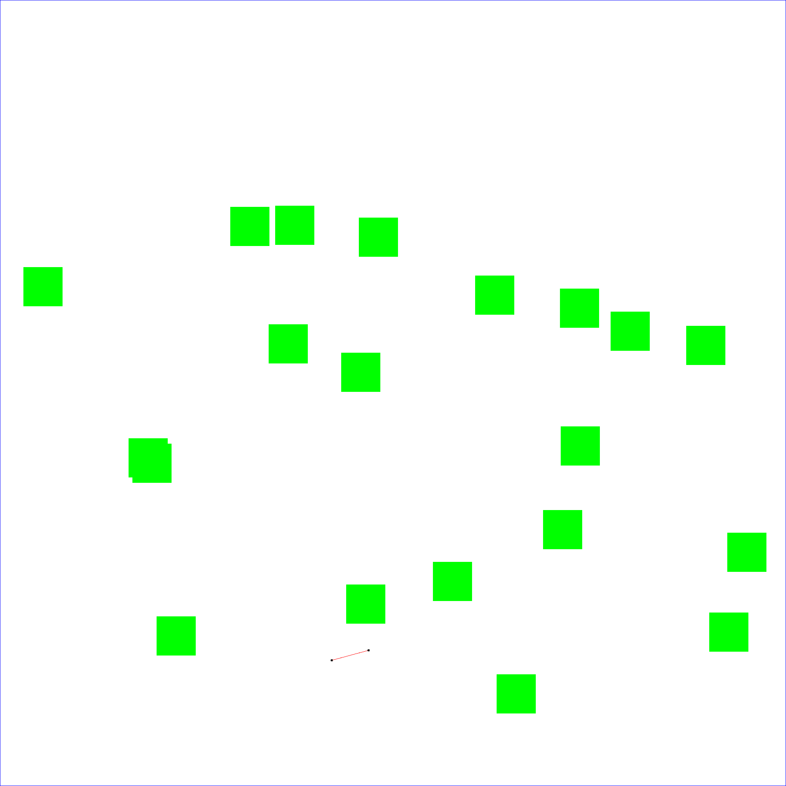
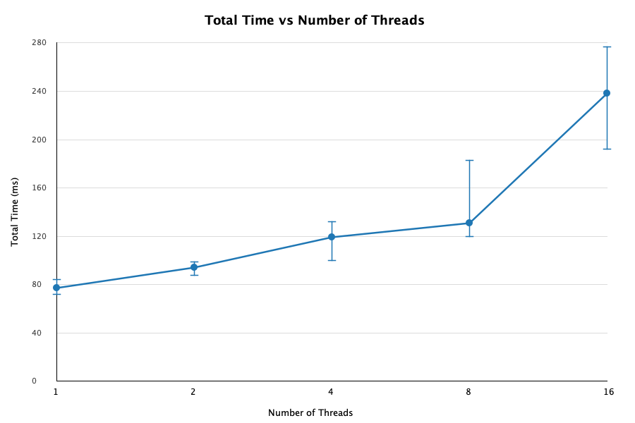
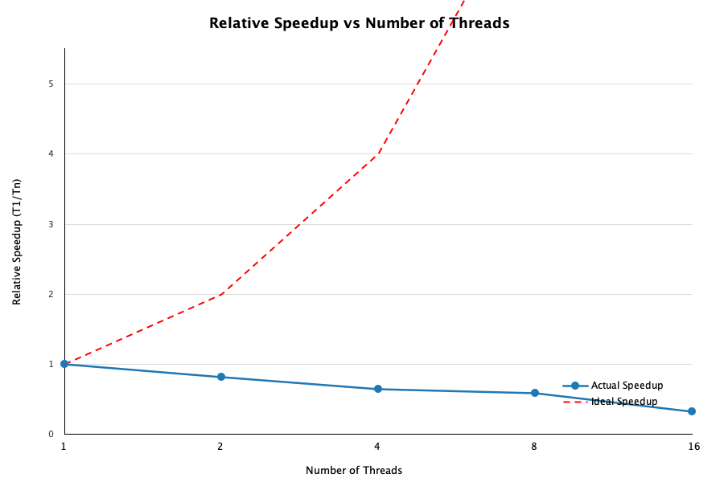

# Concurrent Random Search Tree

## Overview
This program builds a random search tree inside a 2D unit square environment containing 20 randomly placed obstacles. Tree construction is parallelized using a fixed-size thread pool.

## How to Run

```
javac q1.java
java q1 -n <nodes> -b <branching> -r <maxdist> -t <threads> -s <seed>
```

### Parameters
- `-n` : number of nodes in the tree (> 1)
- `-b` : branching factor, max edges per node (> 1)
- `-r` : max distance between adjacent nodes, in (0.0, 1.0)
- `-t` : number of threads (≥ 1)
- `-s` : random seed for reproducibility

### Example
```
java q1 -n 10000 -b 3 -r 0.05 -t 4 -s 42
```

## Output
Produces `outputimage.png` showing the tree (red edges, black nodes) and obstacles (green) within the boundary (blue).



## Timing Results (n=10000, b=3, r=0.05, averaged over 5 runs)





| Threads (t) | Avg Time (ms) |
|-------------|---------------|
| 1           | 77            |
| 2           | 94            |
| 4           | 119           |
| 8           | 131           |
| 16          | 238           |

## How to Run (recommended)
```
java q1 -n 10000 -b 3 -r 0.05 -t 4 -s 42
```

## Analysis
It works best when t = 1. This is awkward as more threads actually slows the program down. This is probably because high contention happens in `synchronized(tree)`. Each task does a small amount of computation (random point generation and geometry checks) followed by a short critical section to add the node. With fine-grained tasks like these, thread coordination overhead and lock contention dominate over any parallel benefit. The single global tree lock becomes a bottleneck as more threads compete for it simultaneously.
